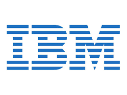

   

# IBM
<!-- What does your company do? What makes you interesting? Why should a team use your tech? Enter text below: -->
IBM Cloud is your one-stop cloud computing shop providing all the cloud solutions and cloud tools you need for developing and hosting your winning Hackathon project.

# Challenge Info
<!-- What are you looking for? How will teams be judged? Enter text below:  -->
_Arriving Soon_

# Prize Info
<!-- What is your sponsor prize? Is it one for each member? Enter text below: -->
_Arriving Soon_

# Getting Started
<!-- How do teams use your tech? Do you have links to resources? Are there directories here that include sample projects? Enter text below: -->
_Arriving Soon_

# Support

IBM will be on-site throughout the event to assist you.

### Event Support
<!-- Add every member of your team here, provide as much detail as possible and use the format below -->
<!-- Leave each   where it is, they are used to make the formatting here nice! -->

Example Smith  
Email: Example@us.ibm.com  

