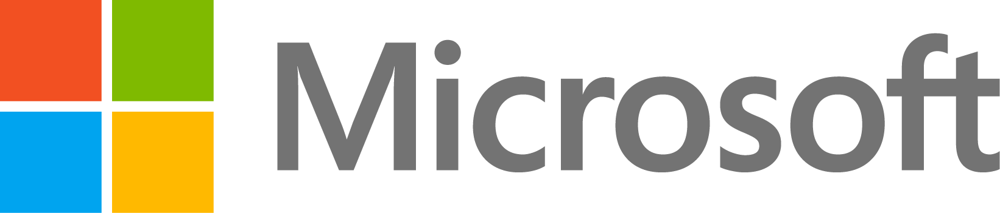

   

# MICROSOFT
<!-- What does your company do? What makes you interesting? Why should a team use your tech? Enter text below: -->
We build world class software supporting Enterprise Business in three Clouds (Azure, Office 365 and Dynamics 365).  

Azure: is an ever-expanding set of cloud services to help your organization meet your business challenges. It’s the freedom to build, manage, and deploy applications on a massive, global network using your favorite tools and frameworks.

Office 365: is a Web-based version of Microsoft's Office suite of enterprise-grade productivity applications. Office 365 is delivered to users through the cloud and includes Exchange Online for email, SharePoint Online for collaboration, Lync Online for unified communications, and a suite of Office Web Apps, Web-based versions of the traditional Microsoft Office suite of applications.

Dynamics 365: is a combination of CRM and ERP. Microsoft's productivity applications, users get a connected view of data intelligence on customer records, transactions, behaviors and preferences, along with information about orders, inventory and shipping, and in addition to predictive insight tools for decision-makers.

We give the developer instant capabilities through extensive services for building applications functionality very quickly. Get your account now for FREE -  https://azure.microsoft.com/en-us/free/

# Vision for travel overview
[Vision for Travel](https://github.com/carolinenakaye/BE-Smart-Hack/blob/master/Sponsors/MSFT_VisionForTravel_IG_R3.pdf)

# Challenge Info
<!-- What are you looking for? How will teams be judged? Enter text below:  -->

Judging Criteria:  Looking for teams who can demonstrate a solution that uniquely sets itself apart from its peers.  Demonstrates a simple mobile interface that provides core capabilities utilizing cloud technologies.   Brings excitement to the Microsoft team on the use of our technology and showcases immediate value to the user of the application.   

# Prize Info
<!-- What is your sponsor prize? Is it one for each member? Enter text below: -->
Winner Prize:  Backpack with Office 365 subscription and Headphones.  Included in the bag is also some cool swag and T-Shirt.   (Value: $350)

# Getting Started
<!-- How do teams use your tech? Do you have links to resources? Are there directories here that include sample projects? Enter text below: -->
Go to https://aka.ms/azure-services-map for all your documentation, training video’s and Step by Step Tutorials.  

Learn about Xamarin and create amazing cloud-powered mobile apps faster : https://azure.microsoft.com/en-us/features/xamarin/

Learn Azure by visiting:  https://docs.microsoft.com/en-us/learn/

# Support

Microsoft will be on-site throughout the event to assist you.

### Event Support
<!-- Add every member of your team here, provide as much detail as possible and use the format below -->
<!-- Leave each   where it is, they are used to make the formatting here nice! -->

Keven Markham  
kevenm@microsoft.com  
text: 972-333-9124  
	
Chad Liberto  
chlibert@microsoft.com  
214-394-3091  

