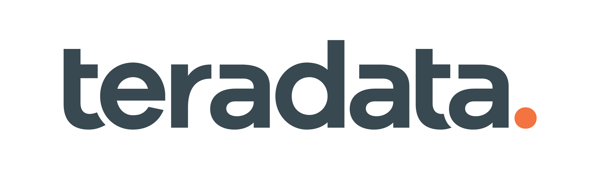

   

# Teradata
<!-- What does your company do? What makes you interesting? Why should a team use your tech? Enter text below: -->

Teradata offers Vantage- a modern cloud analytics platform that combines open source and commercial analytic technologies together to operationalize insights, 
solve complex business problems, and enable descriptive, predictive and prescriptive analytics, that lead to autonomous decision-making.

# Challenge Info
<!-- What are you looking for? How will teams be judged? Enter text below:  -->

The team that best leverages Vantage Data and Analytic capabilities within their hack, solving business problems will be 
selected to receive our prize 

# Prize Info
<!-- What is your sponsor prize? Is it one for each member? Enter text below: -->

Bose QuietComfort 35 II Wireless Bluetooth Headphones, Noise-Cancelling, with Alexa voice control, enabled with Bose AR – Black
One for each team member

# Getting Started
<!-- How do teams use your tech? Do you have links to resources? Are there directories here that include sample projects? Enter text below: -->

Load your data into the environment using Teradata Studio (available @ Teradata Downloads site below), and start analyzing it with SQL, R or Python.

TechBytes Videos:
https://www.youtube.com/playlist?list=PL94YoXtBVbdqQW4CdajZ9NIyzxs6v2q8A

Teradata Downloads:
https://downloads.teradata.com

Teradata Documentation:
https://docs.teradata.com

# Support

We will be on-site throughout the event to assist you.

### Event Support

Lou Bogdos 
Lou.Bogdos@teradata.com 
817-832-2856 

Gerik Grant 
Gerik.Grant@teradata.com 
407-590-7325 

Vily Dardanes 
vily.dardanes@teradata.com 
224-567-0704 
