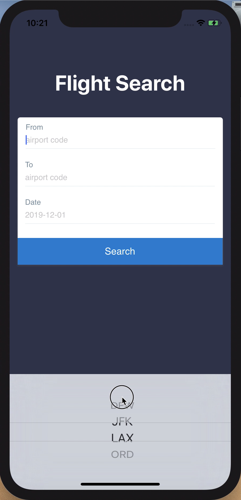
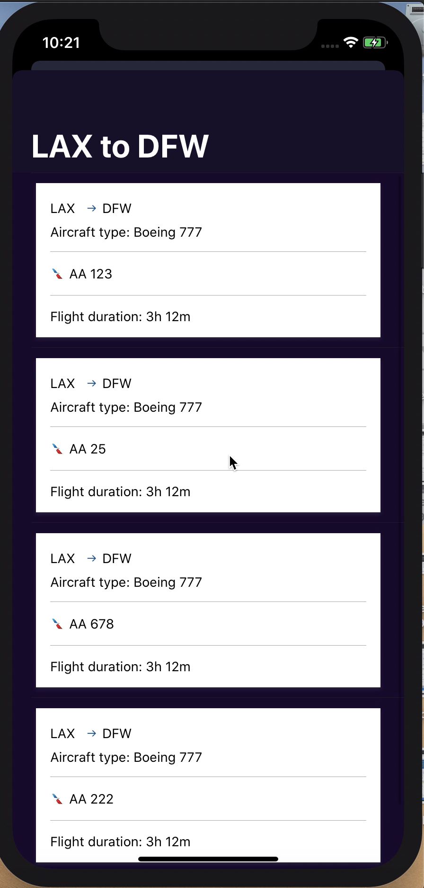

# flight-search-ios

A simple flight search app that gives you a detailed list of flights to your favorite destination.


## UI

Launch Screen | Search Flights | Flight List
:-------------------------------------:|:-------------------------------------------:|:------------------------------------------------:
  |   | 

#### Error Handling 
Missing fields | Duplicate Entry | Invalid Entry
:-------------------------------------:|:-------------------------------------------:|:------------------------------------------------:
  |   | 

## Flight Generator
#### Request

GET Flights

```
https://flight-engine-behack2019.herokuapp.com/flights?date=2019-09-06&origin=lax&destination=dfw
```

**Params**

```
date	"2019-09-06"
Departure date (origin) for the desired flight (e.g., "2019-09-06")

origin	"lax"
Airport code for origin. Possible values: "DFW", "JFK", "LAX", "ORD"

destination	"dfw"
Airport code for destination. Possible values: "DFW", "JFK", "LAX", "ORD"
```

#### Response

```[
    {
        "flightNumber": "4923",
        "origin": {
            "code": "LAX",
            "city": "Los Angeles",
            "location": {
                "latitude": 33.9416,
                "longitude": 118.4085
            }
        },
        "destination": {
            "code": "DFW",
            "city": "Dallas-Fort Worth",
            "location": {
                "latitude": 32.8998,
                "longitude": 97.0403
            }
        },
        "distance": 1234,
        "duration": {
            "locale": "3h 16m",
            "hours": 3,
            "minutes": 16
        },
        "aircraft": {
            "model": "321",
            "passengerCapacity": {
                "total": 181,
                "main": 165,
                "first": 16
            },
            "speed": 400
        }
    },
    {
        "flightNumber": "5446",
        "origin": {
            "code": "LAX",
            "city": "Los Angeles",
            "location": {
                "latitude": 33.9416,
                "longitude": 118.4085
            }
        },
        "destination": {
            "code": "DFW",
            "city": "Dallas-Fort Worth",
            "location": {
                "latitude": 32.8998,
                "longitude": 97.0403
            }
        },
        "distance": 1234,
        "duration": {
            "locale": "3h 16m",
            "hours": 3,
            "minutes": 16
        },
        "aircraft": {
            "model": "738",
            "passengerCapacity": {
                "total": 160,
                "main": 144,
                "first": 16
            },
            "speed": 400
        }
    },
    {
        "flightNumber": "7075",
        "origin": {
            "code": "LAX",
            "city": "Los Angeles",
            "location": {
                "latitude": 33.9416,
                "longitude": 118.4085
            }
        },
        "destination": {
            "code": "DFW",
            "city": "Dallas-Fort Worth",
            "location": {
                "latitude": 32.8998,
                "longitude": 97.0403
            }
        },
        "distance": 1234,
        "duration": {
            "locale": "3h 6m",
            "hours": 3,
            "minutes": 6
        },
        "aircraft": {
            "model": "738",
            "passengerCapacity": {
                "total": 160,
                "main": 144,
                "first": 16
            },
            "speed": 400
        }
    },
    {
        "flightNumber": "5701",
        "origin": {
            "code": "LAX",
            "city": "Los Angeles",
            "location": {
                "latitude": 33.9416,
                "longitude": 118.4085
            }
        },
        "destination": {
            "code": "DFW",
            "city": "Dallas-Fort Worth",
            "location": {
                "latitude": 32.8998,
                "longitude": 97.0403
            }
        },
        "distance": 1234,
        "duration": {
            "locale": "3h 18m",
            "hours": 3,
            "minutes": 18
        },
        "aircraft": {
            "model": "757",
            "passengerCapacity": {
                "total": 176,
                "main": 160,
                "first": 16
            },
            "speed": 380
        }
    },
    {
        "flightNumber": "5190",
        "origin": {
            "code": "LAX",
            "city": "Los Angeles",
            "location": {
                "latitude": 33.9416,
                "longitude": 118.4085
            }
        },
        "destination": {
            "code": "DFW",
            "city": "Dallas-Fort Worth",
            "location": {
                "latitude": 32.8998,
                "longitude": 97.0403
            }
        },
        "distance": 1234,
        "duration": {
            "locale": "3h 10m",
            "hours": 3,
            "minutes": 10
        },
        "aircraft": {
            "model": "738",
            "passengerCapacity": {
                "total": 160,
                "main": 144,
                "first": 16
            },
            "speed": 400
        }
    },
    {
        "flightNumber": "5295",
        "origin": {
            "code": "LAX",
            "city": "Los Angeles",
            "location": {
                "latitude": 33.9416,
                "longitude": 118.4085
            }
        },
        "destination": {
            "code": "DFW",
            "city": "Dallas-Fort Worth",
            "location": {
                "latitude": 32.8998,
                "longitude": 97.0403
            }
        },
        "distance": 1234,
        "duration": {
            "locale": "3h 28m",
            "hours": 3,
            "minutes": 28
        },
        "aircraft": {
            "model": "757",
            "passengerCapacity": {
                "total": 176,
                "main": 160,
                "first": 16
            },
            "speed": 380
        }
    },
    {
        "flightNumber": "8080",
        "origin": {
            "code": "LAX",
            "city": "Los Angeles",
            "location": {
                "latitude": 33.9416,
                "longitude": 118.4085
            }
        },
        "destination": {
            "code": "DFW",
            "city": "Dallas-Fort Worth",
            "location": {
                "latitude": 32.8998,
                "longitude": 97.0403
            }
        },
        "distance": 1234,
        "duration": {
            "locale": "3h 13m",
            "hours": 3,
            "minutes": 13
        },
        "aircraft": {
            "model": "738",
            "passengerCapacity": {
                "total": 160,
                "main": 144,
                "first": 16
            },
            "speed": 400
        }
    }
]
```
## Making a network request in swift

## Actionable button in swift

## Loading data from response

## Testing

Making sure your implementation meet the requirements and is ready to ship.