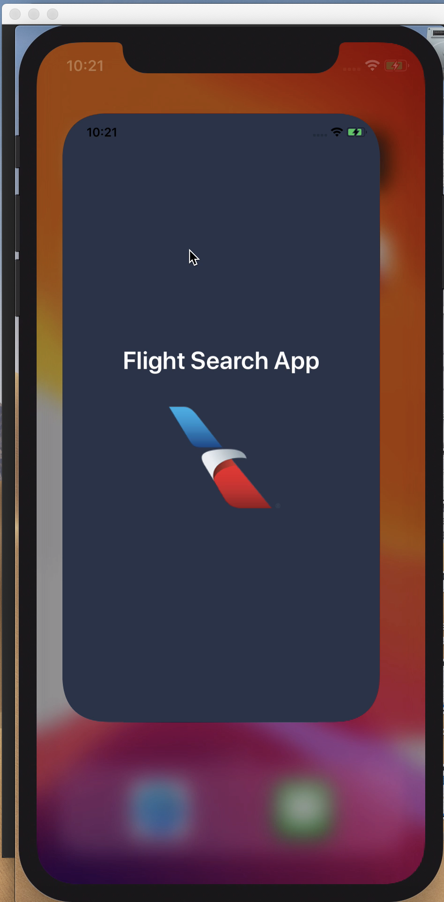
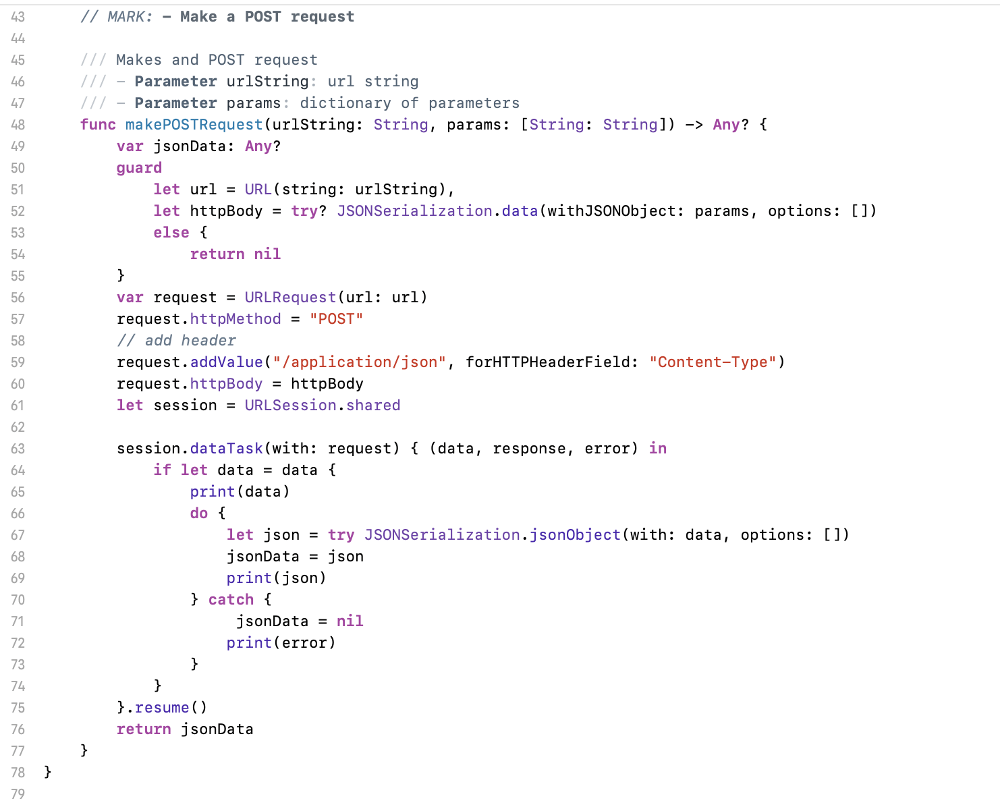

# flight-search-ios

A simple iOS app that gives you a detailed list of flights to your favorite destination.


## Table of Contents

- [Getting started](#Getting_started)
- [What does the app look like?](#UI)
    - [Error Handling](#errors)
- [Flight Generator API](#running_tests)
    - [Request](#request)
    - [Response](#response)
- [Making a network request in swift](#network_request)
- [Making a Button actionable in swift](#network_request)
    - [Directly connect viewcontroller in the storyboard](#storyboard)
    - [Using an IBAction](#ibaction)
    - [Using a segue way](#segue)

## Getting started <a name="Getting_started"></a>

First, you need to be working on a MacBook or MacMini.

- Then install XCode 11/10
- Fork the git repo
- Then open `FlightSearch.xcodeproj` in XCode.

Once XCode is open, hit the RUN button to build the app.


## What does the app look like? <a name="UI"></a>

Launch Screen | Search Flights | Flight List
:-------------------------------------:|:-------------------------------------------:|:------------------------------------------------:
  |   | 

#### Error Handling <a name="errors"></a>
Missing fields | Duplicate Entry | Invalid Entry
:-------------------------------------:|:-------------------------------------------:|:------------------------------------------------:
  |   | 

## Flight Generator API <a name="API"></a>
#### Request <a name="request"></a>

GET Flights

```
https://flight-engine-behack2019.herokuapp.com/flights?date=2019-09-06&origin=lax&destination=dfw
```

**Params**

```
date	"2019-09-06"
Departure date (origin) for the desired flight (e.g., "2019-09-06")

origin	"lax"
Airport code for origin. Possible values: "DFW", "JFK", "LAX", "ORD"

destination	"dfw"
Airport code for destination. Possible values: "DFW", "JFK", "LAX", "ORD"
```

#### Response <a name="response"></a>

```
[
    {
        "flightNumber": "4923",
        "origin": {
            "code": "LAX",
            "city": "Los Angeles",
            "location": {
                "latitude": 33.9416,
                "longitude": 118.4085
            }
        },
        "destination": {
            "code": "DFW",
            "city": "Dallas-Fort Worth",
            "location": {
                "latitude": 32.8998,
                "longitude": 97.0403
            }
        },
        "distance": 1234,
        "duration": {
            "locale": "3h 16m",
            "hours": 3,
            "minutes": 16
        },
        "aircraft": {
            "model": "321",
            "passengerCapacity": {
                "total": 181,
                "main": 165,
                "first": 16
            },
            "speed": 400
        }
    }
]
```
## Making a network request in swift <a name="network_request"></a>

GET async request  | POST request
:-------------------------------------:|:-------------------------------------------:
  |   

## Making a Button actionable in swift <a name="Button"></a>

#### Directly connect viewcontroller in the storyboard <a name="storyboard"></a>
 

#### Using an IBAction <a name="ibaction"></a>
 

#### Setting up a segue way programmatically <a name="segue"></a>
 
